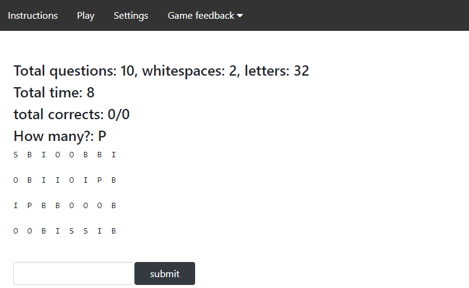

# Count letters game

This project was bootstrapped with [Create React App](https://github.com/facebook/create-react-app).

## Description

- count letters game is self descriptive, count how many of the specified letter you can see in the matrix.
- In settings you can update whitespaces which is the space between rows and between columns. You can also modify the number of letters in the matrix and how many questions.
- In feedback you can see the global stats of the game. The score stats are filtered using the current settings (number of questions and letters). On the other hand, the stats for questions are not filtered.
- The 'Play' tab is... to play the game. That's it, hope you like it.

## Backend

- The backend was deployed in Heroku and build using Ruby on Rails and PostgreSQ.
- Link backend: https://lit-shelf-55398.herokuapp.com/
- Link Github repository of the backend: https://github.com/andresporras3423/count-letters-rb

## Frontend tools

- JavaScript
- HTML/CSS
- React
- Bootstrap
- Netlify

## Backend tools

- Ruby
- Ruby on Rails
- PostgreSQL
- Heroku

## Author

**Oscar Russi**

- Github: [@andresporras3423](https://github.com/andresporras3423/)
- Linkedin: [Oscar Russi](https://www.linkedin.com/in/oscar-andres-russi-porras/)
- Twitter: [@OscarRussi1](https://twitter.com/OscarRussi1)